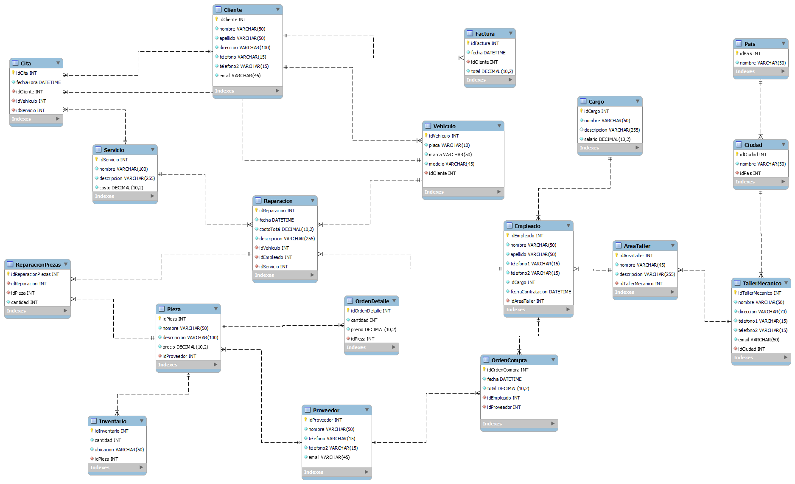
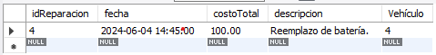
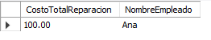

## TallerAutomotrizBD_MySQL

### Modelo Entidad Relación de la Base de Datos.


## Consultas
1. Obtener el historial de reparaciones de un vehículo específico.
```sql
SELECT r.idReparacion, r.fecha, r.costoTotal, rdescripcion, r.idVehiculo as Vehículo
FROM Reparacion r
WHERE idVehiculo = 4
```


2. Calcular el costo total de todas las reparaciones realizadas por un empleado específico en un período de tiempo.

```sql
SELECT SUM(r.costoTotal) as CostoTotalReparacion, e.nombre as NombreEmpleado
FROM Empleado e
JOIN Reparacion r ON e.idEmpleado = r.idEmpleado
WHERE e.idEmpleado = 4
AND r.fecha BETWEEN '2024-06-01' and '2024-06-05'
```

