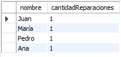

## TallerAutomotrizBD_MySQL

### Modelo Entidad Relación de la Base de Datos.


## Consultas
1. Obtener el historial de reparaciones de un vehículo específico.
```sql
SELECT r.idReparacion, r.fecha, r.costoTotal, rdescripcion, r.idVehiculo as Vehículo
FROM Reparacion r
WHERE idVehiculo = 4
```


2. Calcular el costo total de todas las reparaciones realizadas por un empleado específico en un período de tiempo.

```sql
SELECT SUM(r.costoTotal) as CostoTotalReparacion, e.nombre as NombreEmpleado
FROM Empleado e
JOIN Reparacion r ON e.idEmpleado = r.idEmpleado
WHERE e.idEmpleado = 4
AND r.fecha BETWEEN '2024-06-01' and '2024-06-05'
```


3. Listar todos los clientes y los vehículos que poseen

```sql
SELECT c.nombre AS NombreCliente, v.placa AS PlacaVehiculo, v.marca AS MarcaVehiculo, v.modelo AS ModeloVehiculo
FROM Cliente c
INNER JOIN Vehiculo v ON c.idCliente = v.idCliente;
```


4. Obtener la cantidad de piezas en inventario para cada pieza.

```sql
SELECT p.nombre AS NombrePieza, COUNT(i.idInventario) AS CantidadEnInventario
FROM Pieza p
LEFT JOIN Inventario i ON p.idPieza = i.idPieza
GROUP BY p.nombre;
```


5. Obtener las citas programadas para un día específico.

```sql
SELECT c.idCita, c.fechaHora, cl.nombre
FROM Cita c
JOIN Cliente cl ON c.idCita = cl.idCliente
WHERE DATE(fechaHora) = '2024-06-14';
```


6. Generar una factura para un cliente específico en una fecha determinada

```sql
SELECT f.idFactura, c.idCliente, CONCAT(c.nombre, ' ', c.apellido) AS nombreCliente, f.fecha, f.total
FROM Factura f
JOIN Cliente c ON f.idCliente = c.idCliente
WHERE c.idCliente = 7 AND DATE(fecha) = '2024-06-07';
```


7. Listar todas las órdenes de compra y sus detalles.
```sql
SELECT oc.idOrdenCompra, oc.fecha,oc.total, od.idOrdenDetalle, od.cantidad, od.precio, p.nombre AS nombrePieza, p.descripcion AS descripcionPieza
FROM OrdenCompra oc
JOIN OrdenDetalle od ON oc.idOrdenCompra = od.idOrdenDetalle
JOIN Pieza p ON od.idPieza = p.idPieza
ORDER BY oc.idOrdenCompra;
```


8. Obtener el costo total de piezas utilizadas en una reparación específica.
```sql
SELECT SUM(rp.cantidad * p.precio) AS costoTotalPiezas
FROM ReparacionPiezas rp
JOIN Pieza p ON rp.idPieza = p.idPieza
WHERE rp.idReparacion = 10;
```


9. Obtener el inventario de piezas que necesitan ser reabastecidas (cantidad menor que un umbral).
```sql
SELECT p.nombre, i.cantidad, i.ubicacion, p.precio
FROM Inventario i
INNER JOIN Pieza p ON i.idPieza = p.idPieza
WHERE i.cantidad < 100;
```


10. Obtener la lista de servicios más solicitados en un período específico.
```sql
SELECT s.nombre, COUNT(r.idServicio) as cantidad
FROM Reparacion r
JOIN Servicio s ON r.idServicio = s.idServicio
WHERE r.fecha BETWEEN '2024-06-01' AND '2024-06-07'
GROUP BY s.nombre
ORDER BY cantidad DESC;
```


11. Obtener el costo total de reparaciones para cada cliente en un período específico.

```sql
SELECT c.nombre, SUM(r.costoTotal) as costoTotal
FROM Reparacion r
JOIN Vehiculo v ON r.idVehiculo = v.idVehiculo
JOIN Cliente c ON v.idCliente = c.idCliente
WHERE r.fecha BETWEEN '2024-06-01' AND '2024-06-07'
GROUP BY c.nombre
ORDER BY costo_total DESC;
```


12. Listar los empleados con mayor cantidad de reparaciones realizadas en un período específico.
```sql
SELECT e.nombre, COUNT(r.idReparacion) as cantidadReparaciones
FROM Reparacion r
JOIN Empleado e ON r.idEmpleado = e.idEmpleado
WHERE r.fecha BETWEEN '2024-06-01' AND '2024-06-05'
GROUP BY e.nombre
ORDER BY cantidadReparaciones DESC;
```


13. Obtener las piezas más utilizadas en reparaciones durante un período específico.
```sql
SELECT p.nombre, SUM(rp.cantidad) as cantidadUsos
FROM ReparacionPiezas rp
JOIN Pieza p ON rp.idPieza = p.idPieza
JOIN Reparacion r ON rp.idReparacion = r.idReparacion
WHERE r.fecha BETWEEN '2024-06-01' AND '2024-06-06'
GROUP BY p.nombre
ORDER BY cantidadUsos DESC;
```


14. Calcular el promedio de costo de reparaciones por vehículo
```sql
SELECT v.placa, AVG(r.costoTotal) as promedioCosto
FROM Reparacion r
JOIN Vehiculo v ON r.idVehiculo = v.idVehiculo
GROUP BY v.placa;
```


15. Obtener el inventario de piezas por proveedor.
```sql
SELECT p.nombre AS Proveedor, SUM(i.cantidad) AS CantidadTotal
FROM Inventario i
INNER JOIN Pieza p ON i.idPieza = p.idPieza
INNER JOIN Proveedor pr ON p.idProveedor = pr.idProveedor
GROUP BY p.nombre;
```


16. Listar los clientes que no han realizado reparaciones en el último año.
```sql
SELECT c.idCliente, c.nombre, c.apellido
FROM Cliente c
LEFT JOIN Vehiculo v ON c.idCliente = v.idCliente
LEFT JOIN Reparacion r ON v.idVehiculo = r.idVehiculo 
AND r.fecha >= DATE_SUB(NOW(), INTERVAL 1 YEAR)
WHERE r.idReparacion IS NULL;
```


17. Obtener las ganancias totales del taller en un período específico.
```sql
SELECT SUM(total) AS ganancias_totales
FROM Factura
WHERE fecha BETWEEN '2024-01-01' AND '2024-12-31';
```


19. Obtener el listado de servicios prestados por cada empleado en un período específico.
```sql
SELECT e.idEmpleado, e.nombre, e.apellido, s.idServicio, s.nombre AS nombreServicio, r.fecha
FROM Reparacion r
JOIN Servicio s ON r.idServicio = s.idServicio
JOIN Empleado e ON r.idEmpleado = e.idEmpleado
WHERE r.fecha BETWEEN '2024-01-01' AND '2024-12-31'
ORDER BY e.idEmpleado, r.fecha;
```


## SUBCONSULTAS

1. Obtener el cliente que ha gastado más en reparaciones durante el último año.
```sql
SELECT c.nombre AS Cliente, SUM(f.total) AS TotalPago, f.fecha
FROM Factura f
JOIN Cliente c
ON c.idCliente = f.idCliente
WHERE f.total = (SELECT MAX(f2.total) FROM Factura f2) AND YEAR(f.fecha) = '2024'
GROUP BY Cliente, f.fecha;
```


3. Obtener los proveedores que suministran las piezas más caras.
```sql
SELECT p.nombre AS Pieza, (SELECT pr.nombre FROM Proveedor pr WHERE pr.idProveedor = p.idProveedor) AS Proveedor, p.precio
FROM Pieza p
ORDER BY p.precio DESC
LIMIT 6;
```


4. Listar las reparaciones que no utilizaron piezas específicas durante el último año.
```sql
SELECT r.idReparacion
FROM Reparacion r
WHERE r.fecha BETWEEN '2023-07-01' AND '2024-07-01'
AND r.idReparacion NOT IN (
    SELECT rp.idReparacion
    FROM ReparacionPiezas rp
    WHERE rp.idPieza = 3
)
LIMIT 6;
```


## Procedimientos Almacenados

1. Crear un procedimiento almacenado para insertar una nueva reparación.
```sql
DELIMITER $$
DROP PROCEDURE IF EXISTS insertarReparacion;
CREATE PROCEDURE insertarReparacion(
    IN p_fecha DATETIME,
    IN p_costoTotal DECIMAL(10,2),
    IN p_descripcion VARCHAR(255),
    IN p_idVehiculo INT,
    IN p_idEmpleado INT,
    IN p_idServicio INT
)
BEGIN
    INSERT INTO Reparacion (idReparacion, fecha, costoTotal, descripcion, idVehiculo, idEmpleado, idServicio) 
    VALUES (null, p_fecha, p_costoTotal, p_descripcion, p_idVehiculo, p_idEmpleado, p_idServicio);
END $$
DELIMITER ;

CALL insertarReparacion('2024-07-01', 100000, 'Cambio Radiador', 3, 1, 5);
```